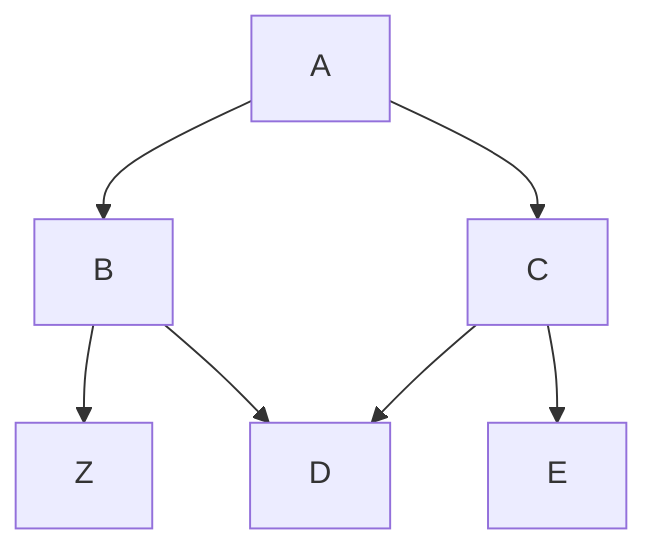

# Thema 1

## Entwicklerdokumentation

Die [Entwicklerdokumentation](DEVELOPERS.md) enthält Hinweise und Anleitungen für Mitarbeiter des Entwicklungsteams.

<table>
<tr>
<td colspan="2">

Dazu braucht man die Erweiterung [Markdown Preview Mermaid Support](https://marketplace.visualstudio.com/items?itemName=bierner.markdown-mermaid).

<tr>
<td>erste spalte</td>
<td>



</td></tr></table>

```js
function handleLink() {
    loadMarkdown(this.getAttribute('href'), '#content');
    event.preventDefault();
    return false;
}
```

```html
<body>
    <div id="sidebar"></div>
    <div id="content"></div>
</body>
````

Dort wird erklärt, wie man einen Entwickler-Rechner für das Projekt konfiguriert, wie man die Quellcodes beschafft und auch , wie die Anwendung intern strukturiert und aufgebaut ist.

## Administration

In der [Administrationsdokumentation](ADMINISTRATION.md) wird erläutert, welche Tätigkeiten ein System Administrator machen kann und soll, um die Brose App in einer Org zu betreiben.

Dazu gehören das Erstellen von Berechtigungen, das Anlegen von Benutzern und das Installieren und Aktualisieren der Brose App. Ferner wird erläutert, wie die Inhalte der Support-Seiten aktualisiert werden können.

## Benutzerdokumentation

Die [Benutzerdokumentation](OPERATION.md) ist in Anwendungsfälle aufgeteilt und richtet sich an verschiedene Anwendertypen der App.

Sowohl Backend-Mitarbeiter von Brose, welche die Bikemodelle und Komponenten pflegen oder neue Firmwares bereitstellen, sind angesprochen als auch Community Benutzer wie etwa Händler oder Hersteller.

Es werden genaue Schrittfolgen aufgeführt, welche Anwendungsfälle wie im System durchgeführt werden können und welche Rahmenbedingungen dabei beachtet werden müssen.
