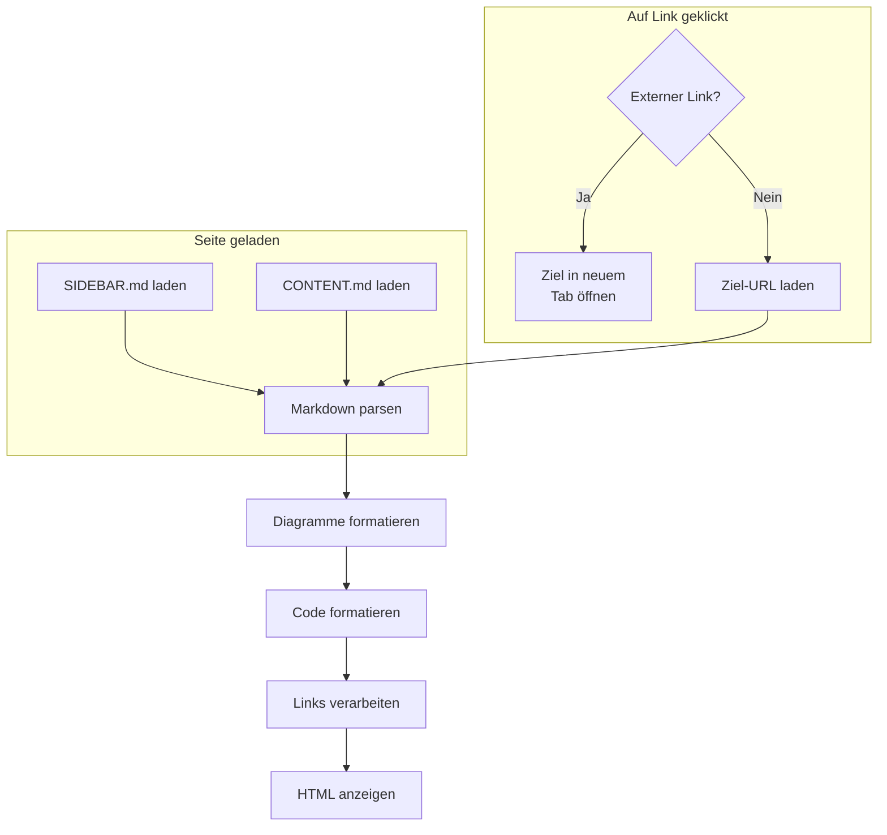

# Render-Prozess



Beim Laden der Seite werden die MarkDown-Dateien `SIDEBAR.md` und `CONTENT.md` in die linke Navigationsleiste und in den Hauptbereich geladen.

Dabei werden die Dateien per `fetch()` mit JavaAScript vom Server geholt und danach mit `marked` in HTML umgewandelt.

Beim Umwandeln werden die `code`- Bereiche analysiert. Enthält dieser ```mermaid``` - Code, wird daraus mit mermaid ein Diagramm generiert und ins Ergebnis-HTML eingebunden.

Andernfalls wird mit `highlight.js` der Code farblich entsprechend der Programmiersprache formatiert und ebenfalls ins HTML eingefügt.

In einem weiteren Schritt werden alle `<a href>`- Links analysiert und durch JavaScript-Funktionen ersetzt. Externe Links werden dabei in einem neuen Tab geöffnet. Relative Links werden als Referenzen auf MarkDown-Dateien verstanden und durchlafen denselben Prozess des Ladens und renderns, wenn sie angeklickt werden. Damit können auch Links innerhalb von Diagrammen mit externen und internen Verweisen versehen werden.

Zum Schluss wird das HTML in den Inhaltsbereich geschrieben und der bestehende Inhalt ersetzt.

Die technische Umsetzung erfolgt in der Datei [softdoc.js](SOFTDOC.md).
